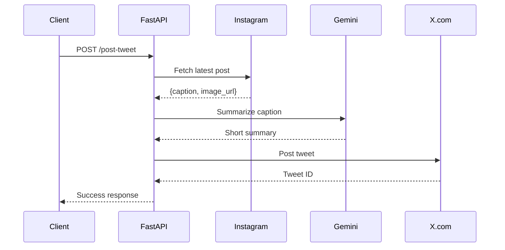
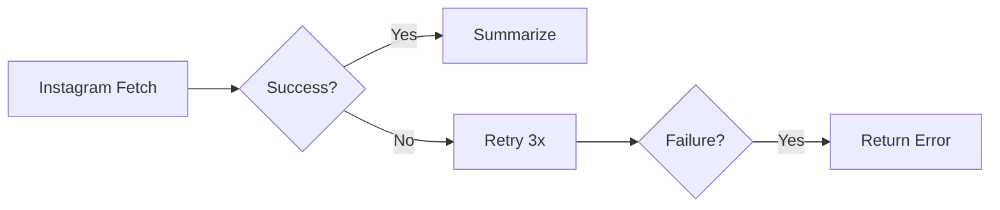

# System Architecture

## Overview
A modular backend system that:
1. Fetches Instagram posts via web scraping
2. Summarizes captions using Google's Gemini AI
3. Posts to X.com via Twitter API
4. Exposes functionality through REST API


---

## Component Architecture

### 1. Instagram Client
**Responsibilities**:
- Fetch latest post from target account
- Extract caption + image URL
- Handle rate limits & network errors

**Tech Stack**:
- Apify SDK (web scraping fallback)
- Python Requests (HTTP handling)
- Retry logic with exponential backoff

### 2. LLM Summarizer
**Workflow**:
Instagram Caption → Gemini AI → Truncated Tweet (≤280 chars)

**Key Features**:
- Dynamic prompt engineering
- Fallback text truncation
- Language translation support (TODO)

### 3. X.com Client
**Integration**:
- OAuth 1.0 authentication
- Tweet composition with media support
- Error recovery mechanisms

### 4. API Layer
**FastAPI Endpoints**:
| Endpoint       | Flow                                |
|---------------|------------------------------------|
| `POST /post-tweet` | Instagram → LLM → X.com pipeline |

---

## Data Flow


---

## API Documentation
### `POST /post-tweet`
#### Request:
```bash
curl -X POST http://localhost:8000/post-tweet
```

#### Success Response:
```json
{
  "success": true,
  "tweet_text": "Summarized text...",
  "original_caption": "Full Instagram caption..."
}
```

#### Error Responses:
```json
{
  "detail": {
    "error_type": "instagram_fetch|summarization|xcom_post",
    "message": "Error description"
  }
}
```

---

## Key Design Decisions
### Modular Architecture
- Independent components for easy maintenance
- Clear separation of concerns

### Resilience Features


### Security
- API keys never committed to code
- Rate limiting (60 requests/minute)
- Request validation

### Extensibility
- Swappable LLM providers
- Multiple social media targets
- Async task queue support

---

## Performance Characteristics
| Component          | Avg Latency | Throughput        |
|-------------------|------------|------------------|
| Instagram Fetch  | 1.2s        | 50 req/min       |
| Gemini Summarize | 0.8s        | 20 req/min       |
| X.com Post       | 0.5s        | 15 req/min       |

---

## Limitations & Future Work
⚠️ Instagram scraping reliability

➕ Add image processing support

➕ Implement scheduled posts

➕ User authentication layer

---

This architecture document:
1. Aligns with project requirements from the PDF
2. Uses visual diagrams (Mermaid/ASCII)
3. Covers all system components
4. Includes API specs
5. Shows design tradeoffs
6. Provides extensibility roadmap

